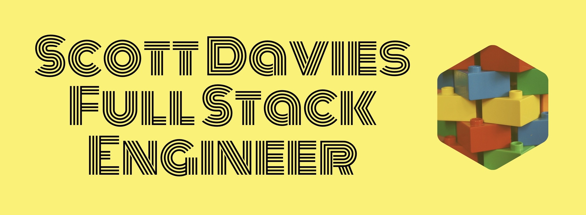
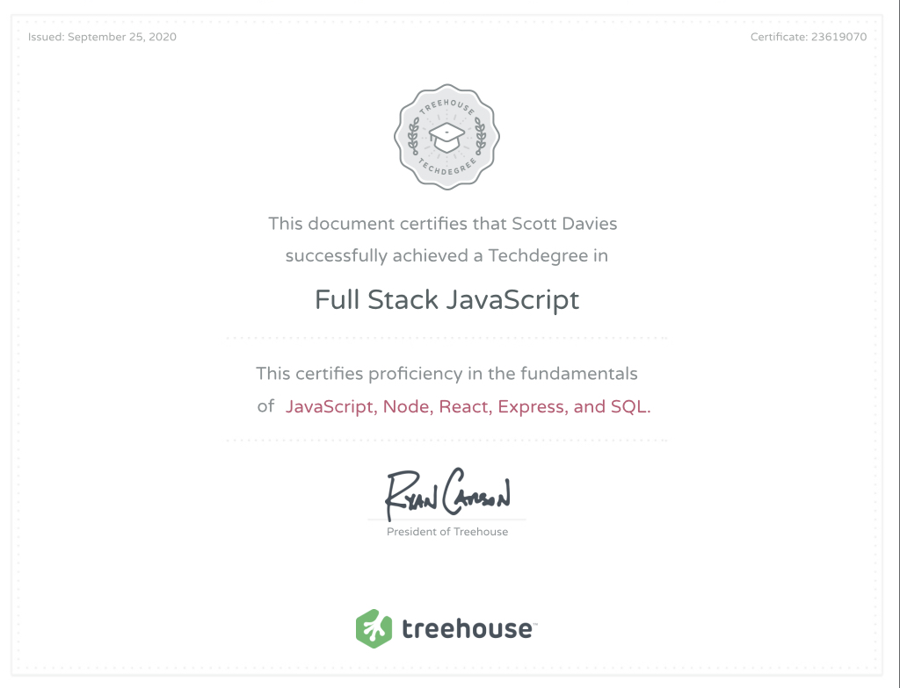
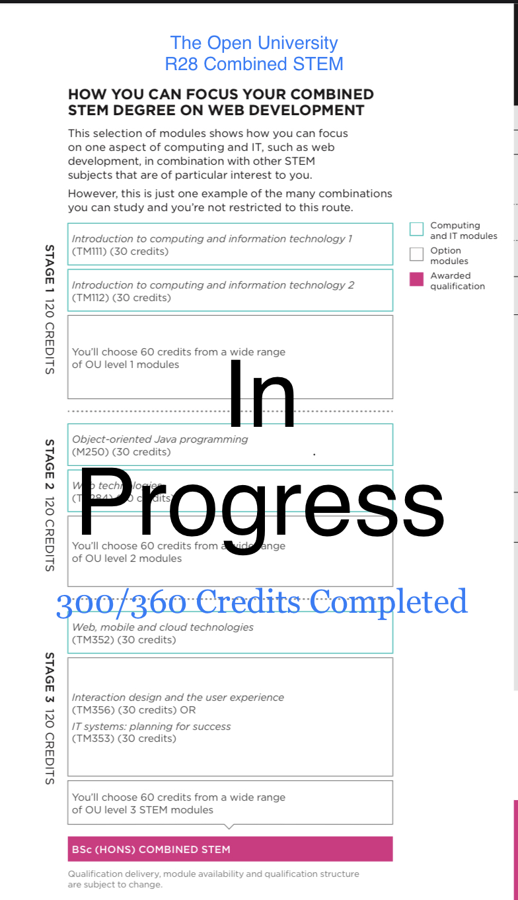
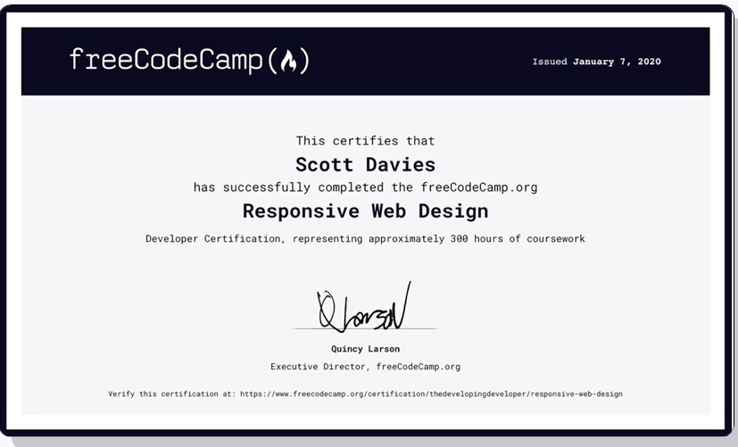
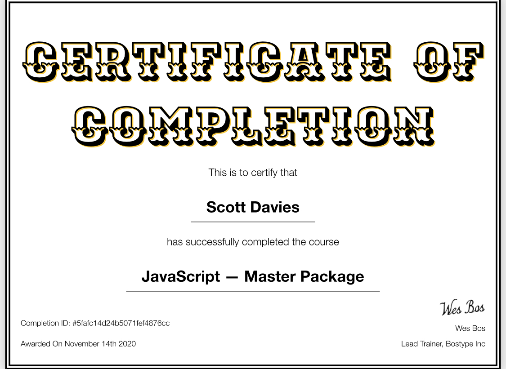
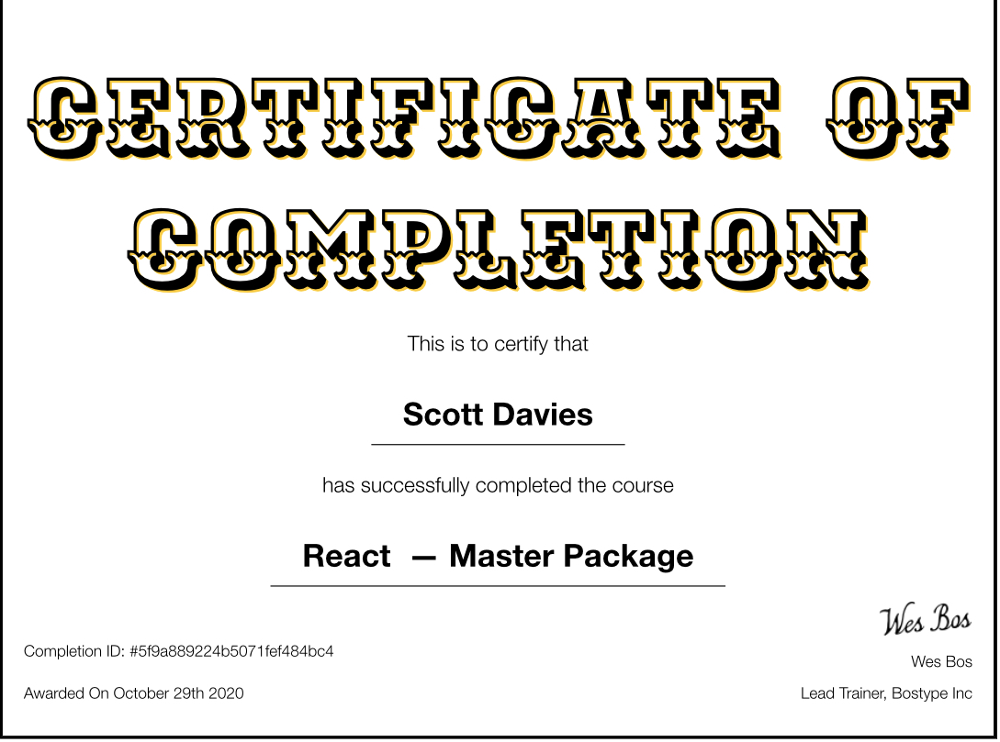
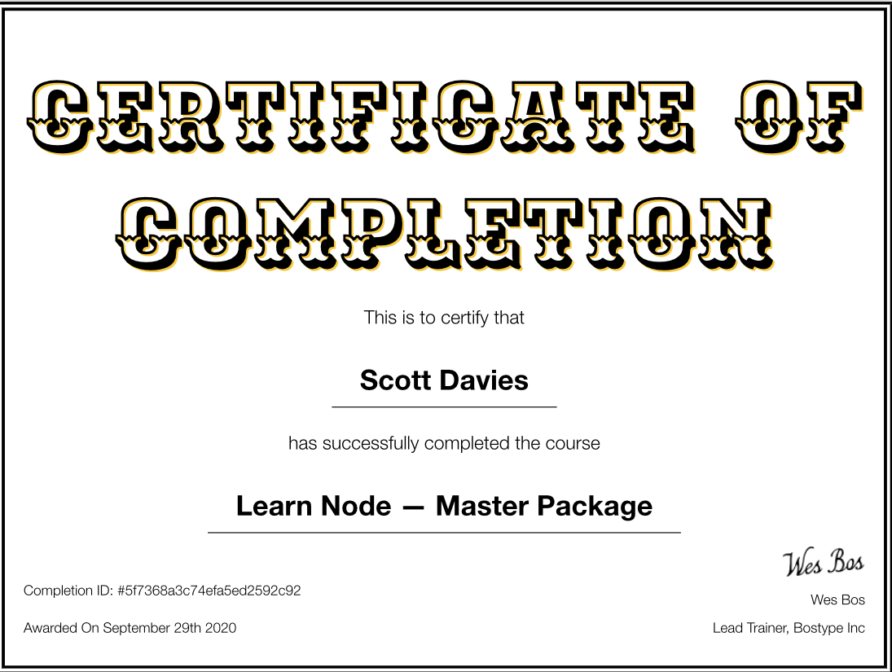

__[Treehouse Full Stack JavaScript Tech-Degree - Online Bootcamp](https://teamtreehouse.com/techdegree/full-stack-javascript)__

__[Open University diploma - Representing my study so far as part of a Bsc in Maths and Software engineering](http://www.open.ac.uk/courses/combined-studies/degrees/bsc-combined-science-maths-technology-engineering-r28)__

__[The Open University R28 - Combined STEM](http://www.open.ac.uk/courses/combined-studies/degrees/bsc-combined-science-maths-technology-engineering-r28)__

__[freeCodeCamp Responsive Web Design](https://www.freecodecamp.org)__

__[Wes Bos JavaScript to further brush up on the fundamentals](https://beginnerjavascript.com)__

__[Wes Bos React](https://reactforbeginners.com)__  

__[Wes Bos Node](https://learnnode.com)__
